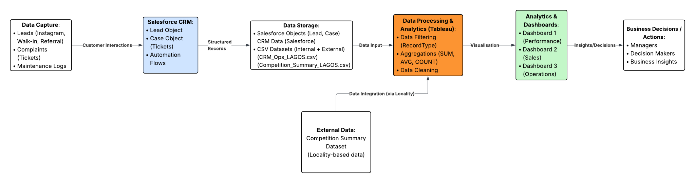
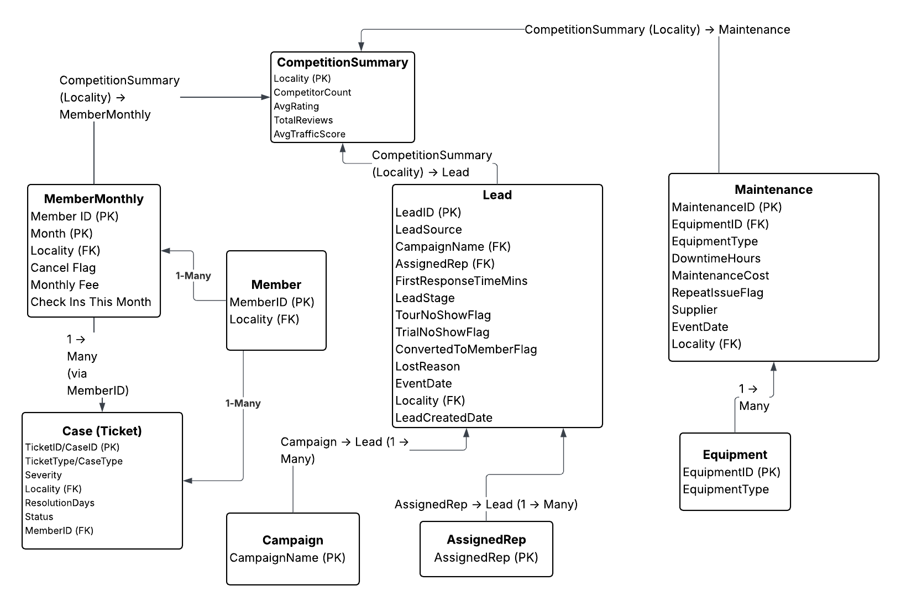
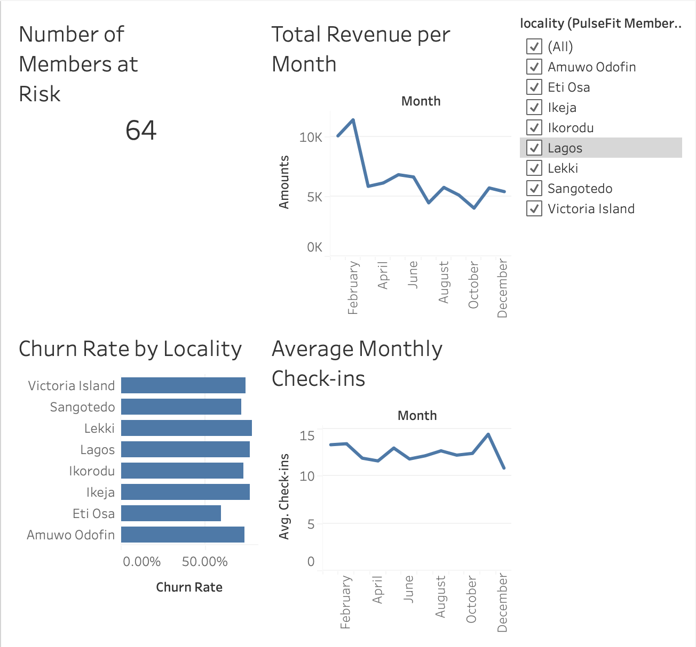
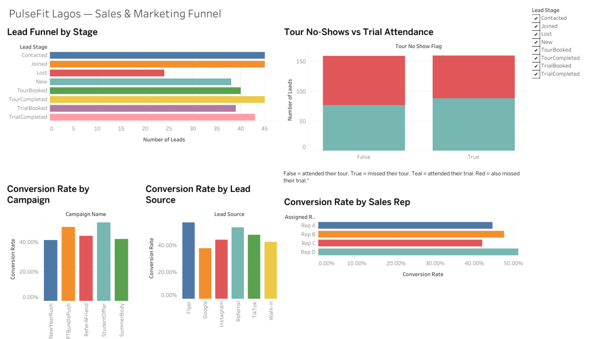
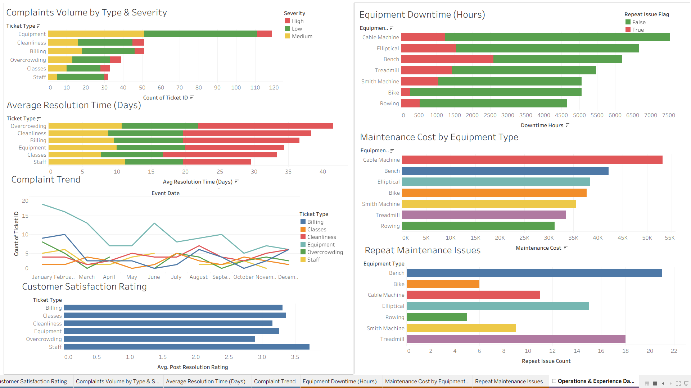
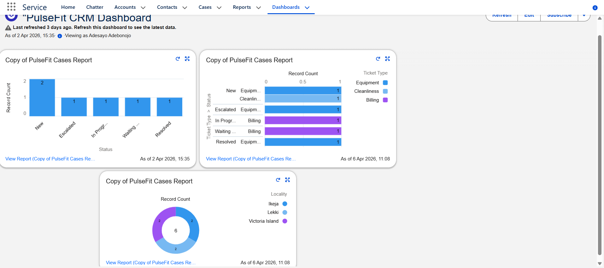

# PulseFit Business Intelligence & CRM Case Study

## Project Overview

PulseFit is a fictional gym business with branches across Lagos, Nigeria. The business was struggling with member cancellations, falling attendance, weak lead follow-up, customer complaints, equipment issues and limited visibility into overall performance.

For this project, we designed a combined business intelligence and CRM solution using Salesforce and Tableau. The aim was to give management a clearer view of what was happening across the business while also improving how leads, complaints and operational issues were tracked.

## Team Project

This was a group project completed as part of the Business Intelligence and Business Analytics module at the National College of Ireland.

The project was completed by:

- Efe Matthew Akpovwovwo
- Adebonojo Adesayo Oluwatosin
- Princewill Chukwuemeka Madugba

The work shown in this repository was not completed by me alone. Different parts of the project were divided between team members, including the CRM implementation, sales and marketing analysis, operations analysis and dashboard development.

My individual contribution is explained separately below.

## Business Problem

PulseFit had several problems affecting customer retention, revenue and day-to-day operations.

Members were cancelling too early, attendance was dropping and the gym did not have a structured way to identify members who were becoming inactive.

The sales process also had weaknesses. Leads came from channels such as Instagram, TikTok, Google, referrals, flyers and walk-ins, but follow-up was inconsistent and there was little visibility into where prospects were dropping out of the funnel.

Operational issues were another problem. Complaints, maintenance issues and equipment downtime were not being tracked consistently, which made it difficult for management to see recurring problems or measure how quickly issues were being resolved.

## Proposed Solution

We designed a solution built around two main tools.

### Salesforce CRM

Salesforce was used to structure the customer and service processes. It supported lead management, opportunity tracking, complaint handling and automated follow-up tasks.

### Tableau

Tableau was used to analyse the data and build interactive dashboards for management.

The solution covered three main areas:

1. Member performance and retention
2. Sales and marketing
3. Operations and customer experience

## Project Walkthrough

A recorded walkthrough of the full project is available on YouTube:

https://youtu.be/6e25B3LjfPI

## System Architecture

The proposed system connected customer interactions, CRM records, member activity, operational records and external competition data.

Salesforce handled structured customer and service information, while Tableau was used to process and visualise the data.



The main information areas included:

- member activity
- cancellations
- revenue
- check-ins
- leads
- campaigns
- sales representatives
- customer complaints
- maintenance activity
- equipment downtime
- competitor information

The different datasets were linked mainly through fields such as locality.

## Data Model

The project also included an entity relationship diagram showing how member, lead, case, maintenance, campaign and competition data could connect.



## Salesforce CRM Implementation

The Salesforce setup covered several parts of the customer journey.

### Sales Pipeline

An eight-stage opportunity pipeline was created to represent the membership sales process from the first enquiry through to conversion or loss.

### Complaint Management

A Case pipeline was created so customer complaints could be tracked from the time they were submitted until they were resolved and closed.

Custom fields were added for information such as:

- ticket type
- severity
- locality
- resolution days
- campaign name
- response time
- tour no-show status
- trial no-show status
- conversion status
- lost reason

### Automated Workflows

Three Salesforce flows were created.

**Lead Assignment and Follow-Up**

When a new lead is created, a follow-up task is automatically created for the person responsible for the lead.

**No-Show Re-Engagement**

If a prospect misses an appointment, Salesforce creates a task so the sales team can contact the person again.

**Equipment Complaint Escalation**

Serious equipment complaints are automatically escalated so they can receive quicker attention.

## Business Intelligence Dashboards

Three main Tableau dashboards were developed for the project.

## Dashboard 1: Performance Overview

The Performance Overview dashboard gives management a simple monthly view of member activity and business performance.

It includes:

- churn rate by locality
- total revenue by month
- average monthly check-ins
- number of members at risk
- locality filtering

Members with very low monthly attendance were identified as being at risk of cancelling. This gives management an early warning instead of waiting until a member has already left.



## Dashboard 2: Sales and Marketing Funnel

The Sales and Marketing dashboard focuses on how potential customers move through the sales process.

It includes:

- lead funnel by stage
- conversion rate by lead source
- conversion rate by campaign
- tour no-shows and trial attendance
- conversion rate by sales representative

The dashboard helps show where leads are being lost and which marketing channels or campaigns are generating stronger results.



## Dashboard 3: Operations and Experience

The Operations and Experience dashboard focuses on complaints and equipment maintenance.

It includes analysis of:

- complaint type
- complaint severity
- average resolution time
- complaint trends
- equipment downtime
- maintenance cost
- repeat maintenance issues

Filters allow management to focus on specific branches and time periods.



## Salesforce CRM Dashboard

A separate Salesforce dashboard was also created to monitor customer complaints.

It includes:

- cases by status
- cases by ticket type
- cases by locality

This gives management a quick view of unresolved complaints and where service problems are occurring.



## My Contribution

This was a team project, so I want to be clear about the parts I personally worked on.

I was responsible for much of the work around the Performance Overview dashboard and the member performance side of the project.

My work included:

- writing the business background and explaining the main problems affecting PulseFit
- defining the analytics requirements for the Performance Overview dashboard
- describing the structure and purpose of the Member Monthly dataset
- helping define the member-related entities and fields used in the database design
- building the Performance Overview dashboard in Tableau
- preparing the data needed for the dashboard
- creating the churn, revenue, attendance and member-risk views
- adding the locality filter
- documenting the dashboard development process
- explaining the dashboard results and how management could use them
- writing the initial impact and expected improvements for the Performance Overview section
- contributing to the conclusion, limitations and future improvements

The Salesforce implementation, Sales and Marketing dashboard and Operations and Experience dashboard involved substantial work from the other members of the team.

## Data

The project used a mixture of simulated and prepared datasets.

Mock data was used to represent areas such as:

- monthly member activity
- sales leads
- complaints
- maintenance records

The CRM and operations dataset contained simulated Lead, Ticket and Maintenance records.

An external competition dataset was also prepared to compare PulseFit's internal performance with the wider gym market across different areas of Lagos.

### Dataset Availability

The original datasets used for the assignment are no longer available.

Because of this, this repository is presented as a business intelligence and CRM case study rather than a fully reproducible data analysis project.

The repository focuses on the final report, dashboard designs, CRM implementation, system architecture and project findings. No replacement or recreated datasets have been added.

## Tools Used

- Tableau Public
- Salesforce CRM
- Excel
- Mockaroo
- Business Intelligence
- Business Analytics
- CRM automation
- Data visualisation
- Dashboard design
- Data modelling

## Main Outcomes

The solution gave PulseFit a more structured way to monitor different parts of the business.

Management could see which branches had higher cancellation levels, whether revenue and attendance were changing, and which members were showing signs of disengagement.

The sales dashboard provided visibility into the customer journey and helped identify where leads were dropping out.

The CRM setup introduced structured lead tracking, complaint management and automated follow-up tasks.

The operations dashboard also made it easier to identify recurring complaints, equipment downtime and maintenance issues.

## Limitations

Most of the project data was simulated, so the dashboards show how the proposed solution could work rather than proving the financial or operational impact of the system in a real gym.

The performance dashboards were also designed mainly around monthly reporting.

In a real implementation, PulseFit could improve the system by connecting live check-in, payment and CRM data through scheduled updates or APIs.

The quality of the dashboards would also depend on staff entering CRM information consistently.

## Future Improvements

The system could be extended in several ways.

Member activity could be monitored more frequently so the gym can contact people soon after their attendance starts to fall.

Lead scoring could also be introduced so the sales team can identify which prospects are more likely to become paying members.

On the operations side, better equipment history could support preventive maintenance instead of waiting for machines to break down.

Live connections between Salesforce, operational systems and Tableau would also reduce manual data handling and allow dashboards to refresh more regularly.

## Repository Structure

```text
pulsefit-business-intelligence-crm/
|
├── README.md
├── report/
│   └── PulseFit_BI_BA_Portfolio_Report.pdf   # add a cleaned portfolio copy here
├── figures/
│   ├── Fig_01_System_Architecture.png
│   ├── Fig_02_ERD.png
│   ├── ...
│   └── Fig_17_Operations_and_Experience_Dashboard.png
└── tables/
    ├── Table_01_Fit_Analysis_Operations.png
    ├── Table_01_Fit_Analysis_Operations.csv
    ├── ...
    └── Table_14_Sample_Cases.csv
```

## Full Report

A cleaned portfolio copy of the Business Intelligence and Business Analytics report can be added to the `report` folder. Before publishing the original university submission publicly, personal student details should be removed.

## Project Video

Full project walkthrough:

https://youtu.be/6e25B3LjfPI

## Note

This repository is intended to show the design, analysis and implementation completed during the project.

It should not be interpreted as an individual project completed solely by me. It was a collaborative university assignment, and the contributions of the other team members are acknowledged above.
